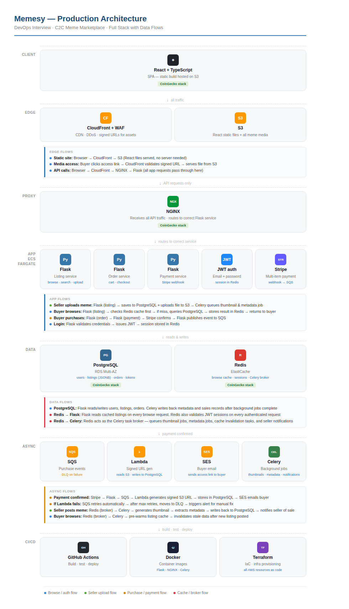

# Memesy — Production Stack Proposal

> **DevOps Interview — C2C Marketplace**

---

## 1. Requirements Addressed

Each requirement from the brief is addressed below with the specific technology or design decision that satisfies it.

| Requirement                                                                                                                                          | How it is addressed                                                                                                                                                                                                                                                            | Stack component                            |
| ---------------------------------------------------------------------------------------------------------------------------------------------------- | ------------------------------------------------------------------------------------------------------------------------------------------------------------------------------------------------------------------------------------------------------------------------------ | ------------------------------------------ |
| Users will primarily use email and password-based authentication.                                                                                    | Flask handles login using email and password. On success it issues a JWT (JSON Web Token) — a secure digital ID card the user carries for their session. Sessions are stored in Redis for fast validation on every request.                                                   | JWT Auth + Redis                           |
| Memesy is a peer-to-peer marketplace expecting equal amounts of listing and browsing activities.                                                     | Equal read/write load is handled by placing Redis in front of PostgreSQL for all browse requests. Popular listings are cached in Redis so browse traffic does not compete with seller write traffic on the database. NGINX routes requests to the correct Flask service.       | Redis + NGINX + PostgreSQL                 |
| Memesy is discovering their market and needs to adapt quickly to changes in data structure.                                                          | PostgreSQL is used with JSONB columns for listing attributes. JSONB allows variable, flexible fields per meme format (e.g. video duration, image dimensions, audio bitrate) without requiring database migrations every time the data shape changes.                           | PostgreSQL + JSONB                         |
| Buyers can purchase multiple assets in a single payment transaction. Once purchased, each buyer has a unique access link to their copy of the asset. | Stripe Payment Intents support multi-item checkout in one transaction. After payment, SQS triggers Lambda which generates a CloudFront signed URL per asset scoped to the buyer's order ID. No file duplication — one S3 file serves all buyers with individual signed links. | Stripe + SQS + Lambda + S3 + SES           |
| Memesy will launch in US markets, expecting 1M MAU within the first quarter.                                                                         | CloudFront CDN delivers assets globally from US edge locations. ECS Fargate auto-scales Flask services horizontally based on traffic. RDS Multi-AZ ensures database availability. All infrastructure is managed by Terraform for fast, reproducible environment provisioning.  | CloudFront + ECS Fargate + RDS + Terraform |

---

## 2. Proposed Stack

The stack below is selected based on the requirements above.

| Layer          | Technology                | Rationale                                                                                                                        |
| -------------- | ------------------------- | -------------------------------------------------------------------------------------------------------------------------------- |
| Client         | React + TypeScript        | SPA compiled to static files, hosted on S3, served via CloudFront. No server needed at runtime.                                  |
| Edge           | CloudFront + WAF          | CDN for low-latency US delivery. WAF attaches here for DDoS protection and request filtering.                                    |
| Media          | S3                        | Stores all meme assets (image, video, audio) and React static files. Raw bucket is never public.                                 |
| Proxy          | NGINX                     | Reverse proxy in front of Flask services. Routes requests, handles load balancing across ECS tasks.                              |
| Backend        | Flask (Python)            | Lightweight, fast to build. Strong Python ecosystem for media handling (boto3, Pillow). Three services: listing, order, payment. |
| Auth           | JWT (Flask)               | Email/password login issues JWT token. Sessions stored in Redis for fast per-request validation.                                 |
| Payments       | Stripe                    | Multi-item Payment Intents for single transaction checkout. Webhook triggers SQS on payment success.                             |
| Database       | PostgreSQL (RDS Multi-AZ) | Primary data store for users, listings, orders, tokens. JSONB columns for flexible listing attributes.                           |
| Cache          | Redis (ElastiCache)       | Hot listing cache, JWT session store, and Celery task broker. Reduces PostgreSQL read load at 1M MAU.                            |
| Jobs           | Celery                    | Background tasks: thumbnail generation, metadata extraction, cache invalidation, seller notifications.                           |
| Async / Events | SQS + Lambda + SES        | Guaranteed delivery for purchase events. Lambda generates signed URLs. SES emails buyer. DLQ on failure.                         |
| Containers     | ECS Fargate + Docker      | Managed container hosting. No node/cluster management. Scales horizontally on CPU/request metrics.                               |
| CI/CD          | GitHub Actions            | Automated build, test, and deploy pipeline on every merge to main.                                                               |
| IaC            | Terraform                 | All AWS infrastructure as code. Reproducible, version-controlled, no manual console clicking.                                    |

---

## 3. Architecture Diagram

The diagram below shows the full production architecture with data flows annotated per scenario — browse/auth flow, seller upload flow, purchase/payment flow, and cache/broker flow.



**Flow legend:**

- 🔵 Browse / auth flow
- 🟢 Seller upload flow
- 🟡 Purchase / payment flow
- 🔴 Cache / broker flow

---

## 4. How It Works

### When a user visits the site

- Browser loads React app from **S3** via **CloudFront** — no server needed, the static site is cached at edge locations across the US.
- **WAF** sits on CloudFront as a security bouncer — blocking bots, DDoS attempts, and malicious requests before they reach the app.

### When a user logs in

- Login request flows: `Browser → CloudFront → NGINX → Flask (auth)`
- Flask validates credentials against **PostgreSQL** and issues a **JWT token**. Session is stored in **Redis** for fast validation on every subsequent request.

### When a seller posts a meme

- **Flask (listing service)** saves listing details to PostgreSQL and uploads the media file to S3.
- **Celery** picks up background tasks: generates thumbnail, extracts metadata (dimensions, duration), invalidates Redis cache so buyers see the new listing immediately.
- **Seller notification** is queued via Celery — sends an email confirmation that the listing is live.

### When a buyer browses listings

- **Flask (listing service)** checks **Redis cache first** — if the listings are cached, returned instantly without touching PostgreSQL.
- If cache miss: queries PostgreSQL, stores result in Redis, returns to buyer. Celery pre-warms the cache in the background for popular listings.

### When a buyer purchases memes

- **Flask (order + payment services)** sends a multi-item checkout to **Stripe**. One payment, multiple assets.
- Stripe webhook fires on success → Flask publishes purchase event to **SQS**. SQS guarantees the event is not lost even if downstream services fail.
- **Lambda** generates a buyer-scoped **CloudFront signed URL** per asset — unique to that buyer's order. **SES** emails the buyer their access links.
- If Lambda fails: SQS auto-retries. After max retries, message moves to **Dead Letter Queue (DLQ)** — no purchase event is ever silently lost.

### When a seller sells a meme

- Celery updates the seller's sales record in PostgreSQL and sends a **seller notification email** via SES — confirming their meme was sold.

---

## 5. Assumptions

- **Unique access link** = buyer-scoped signed URL, not a physical copy of the file per buyer. One S3 file serves all buyers.
- **1M MAU** does not mean 1M concurrent. Estimated 20–30K peak concurrency, handled by ECS Fargate with 2–4 tasks per service.
- **US-only launch** — single primary region (`us-east-1`) is acceptable. CloudFront handles latency at the edge.
- **No video transcoding, DRM, or content moderation** in MVP scope — raw upload to S3, served direct.
- **Platform commission model** is expected but not in MVP scope. Stripe Connect can be added later without architectural change.

---

## 6. Data Flow Reference

### Browse request (full path)

```
Browser → CloudFront → NGINX → Flask (listing)
       → Redis cache hit?
           yes → return cached listings instantly
           no  → query PostgreSQL → cache in Redis → return to buyer
```

### Purchase flow (full path)

```
Stripe webhook
  → Flask (payment service)
    → validates webhook signature
      → publishes to SQS
        → Lambda: generate CloudFront signed URL per asset
        → Lambda: store access token in PostgreSQL
        → SES: email buyer with access links
          → if fails → DLQ → alert → manual retry
```

### Seller upload flow (full path)

```
Seller submits listing
  → Flask (listing service)
    → save listing to PostgreSQL
    → upload media file to S3
    → return "listing live" to seller immediately
      → Celery (async):
          → generate thumbnail
          → extract metadata (dimensions, duration, bitrate)
          → write metadata back to PostgreSQL
          → invalidate Redis cache
          → send seller confirmation email via SES
```

### Auth flow

```
User submits email + password
  → Flask validates against PostgreSQL
    → issue JWT token
      → store session in Redis
        → return JWT to client
          → all future requests: Flask checks Redis to validate JWT
```

---

*Memesy Production Stack Proposal • DevOps Interview*
